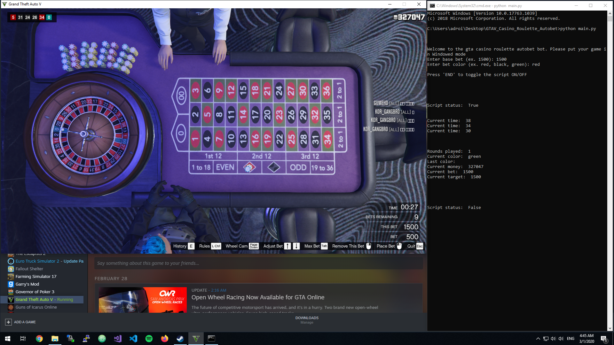
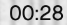
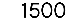

# Say hello to my little GTAV casino roulette bot.
This bot can see what is happening in the roulette rounds by using the OCR library pytesseract(Tesseract) with some PIL image processing and some numpy magic to determine if you won or lost. 
If you lost the bot doubles the current bet until you win otherwise it places "small bets".

**Is it a great way to make money in the game ?** NO, luck is luck and you can still lose more than this bot can win in a bad streak.
**Why did I create this bot ?** For fun and to learn more about OCR and Image processing in python.

</img>

# What the bot sees:

He can see your current balance / money

</img>

He can see the round timer

</img>

 He can see the current placed bet

</img>

And he can also see the last color

</img>
